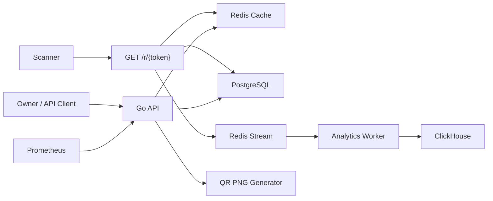

# Architecture

## High-Level Design



## Data Responsibilities

PostgreSQL:

- QR metadata.
- Owner isolation.
- API key metadata.
- Expiration and soft-delete state.

Redis:

- Hot redirect cache.
- Tombstone or negative cache where useful.
- Async scan event stream.

ClickHouse:

- High-volume scan events.
- Daily scan breakdown.
- Aggregate analytics queries.

## Redirect Flow

```text
GET /r/{token}
1. Validate token format.
2. Try Redis cache.
3. On hit, return 302 or 410.
4. On miss, read PostgreSQL.
5. Return 404, 410, or 302.
6. Best-effort cache fill after DB result.
7. Best-effort analytics event enqueue.
```

Redis and analytics are performance/observability layers. They should not turn a successful DB lookup into a user-facing failure.

## Owner Flow

```text
Owner request
1. Authenticate API key.
2. Resolve owner_id.
3. Scope QR query by owner_id.
4. Create/update/delete/read metadata.
```

Every management query must include owner isolation. Public redirect does not require auth.

## QR Image Flow

The QR PNG is generated from the stable short URL:

```text
{PUBLIC_BASE_URL}/r/{token}
```

The PNG is not stored. The image can use long cache headers because changing the target URL does not change the encoded short URL.

## Scale Reasoning

At 50K redirect QPS:

- Without cache, PostgreSQL receives roughly 50K token lookups per second.
- With 95% cache hit rate, DB receives roughly 2.5K QPS.
- With 99% cache hit rate, DB receives roughly 500 QPS.

The design prioritizes high cache hit rate for hot QR campaigns while keeping DB fallback correct for cold or expired cache entries.
